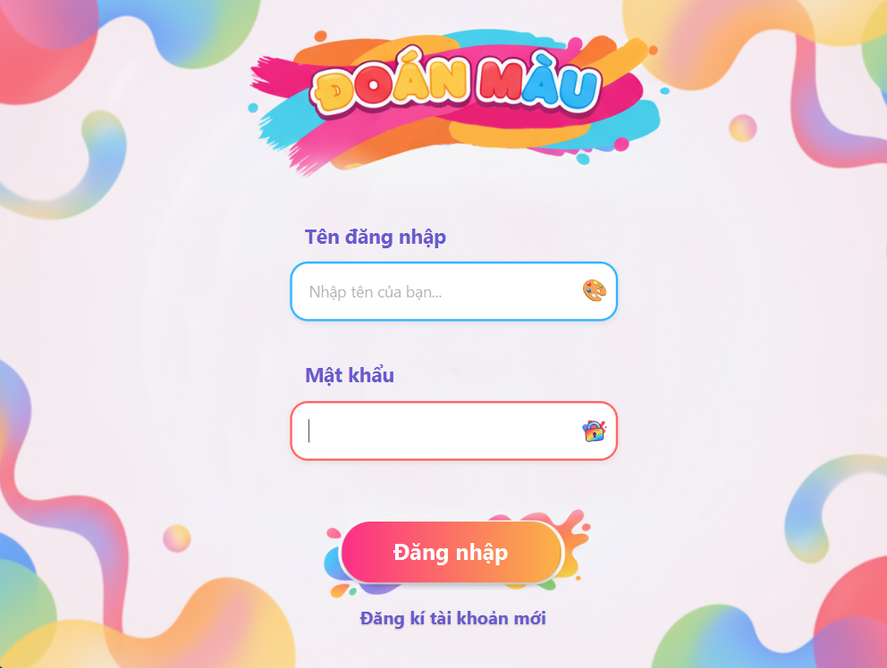
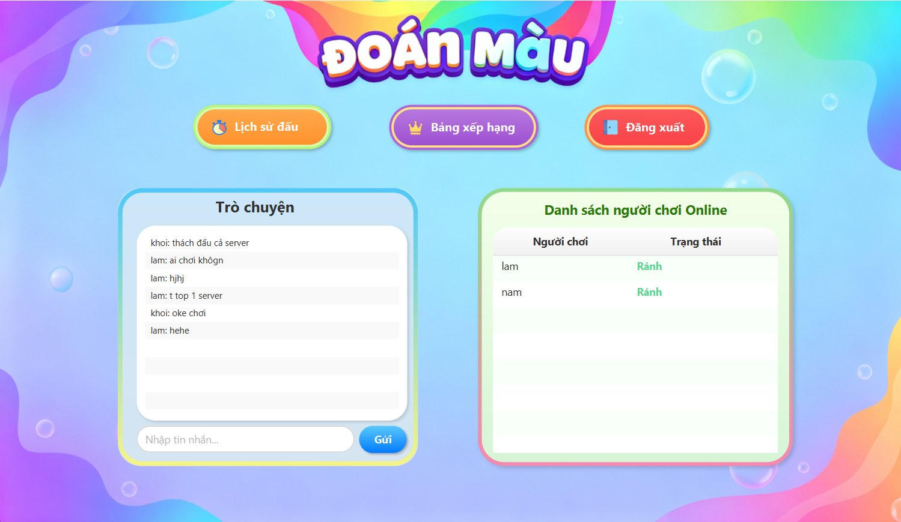
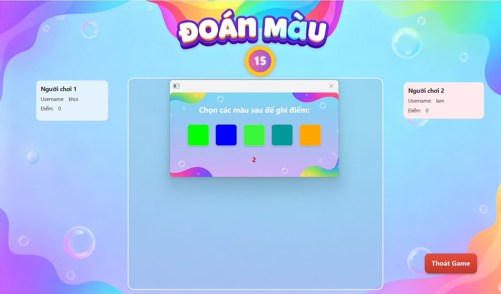
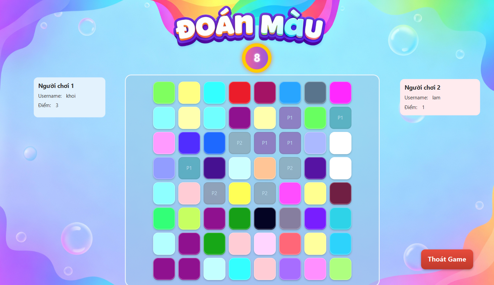
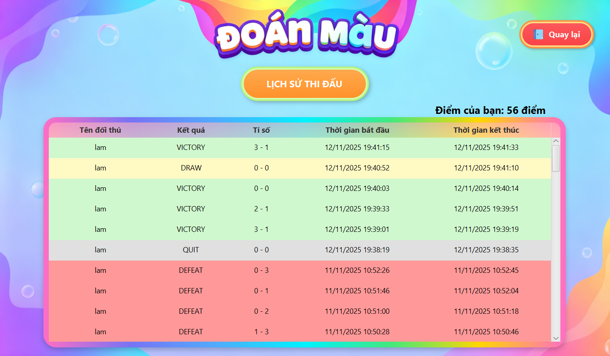
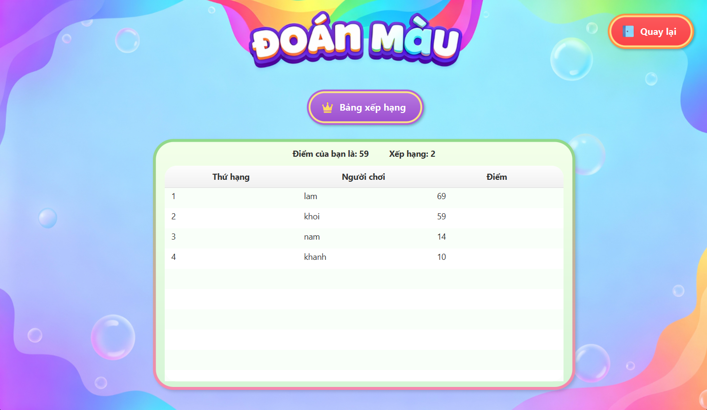

# 🎨 Game Đoán Màu – LTM

## 🧩 Giới thiệu
**Game Đoán Màu** là trò chơi đối kháng trực tuyến, được phát triển bằng **Java Socket**.  
Trong trò chơi, người chơi phải **nhớ nhanh các màu sắc đã hiển thị trước đó** và chọn lại chính xác trong một bảng màu có nhiều màu khác nhau trong thời gian giới hạn.

---

## 🚀 Chức năng chính
- Xác thực người dùng: **đăng ký, đăng nhập, đăng xuất**.
- Hiển thị danh sách người chơi đang online kèm trạng thái.
- Gửi và nhận **lời mời thách đấu**.
- Chơi game đối kháng 1 - 1
- Chức năng **xem bảng xếp hạng** và **xem lịch sử đấu**.

---

## 🕹️ Luật chơi
- Màn hình hiển thị **5 màu mục tiêu ngẫu nhiên trong 3 giây**, sau đó **bảng màu 8x8** xuất hiện.
- Mỗi người chơi chọn các ô màu đúng trong **15 giây**:
  - ✅ Đúng: +1 điểm
  - ❌ Sai: –1 điểm
- Người chơi không thể chọn màu đối thủ đã chọn
- Kết thúc ván, server so sánh điểm và xử lý **thắng (+2), hòa (+1), thua (0)**.
- Nếu người chơi **thoát giữa trận** thì sẽ xử thắng cho đối thủ.

---

## 📂 Cấu trúc thư mục
```
btl_ltm/                                   
├── src/ main/
|          ├── java/               
|          │   ├── client/
|          │   │   ├── controller/              # Controller xử lý giao diện client
|          │   │   ├── Client.java              # Lớp kết nối client với server
|          │   │   └── RunClient.java           # Điểm khởi chạy Client
|          │   ├── constant/                    # Khai báo hằng số chung
|          │   ├── model/                       # Các lớp mô hình dữ liệu
|          │   ├── server/
|          │   │   ├── controller/              # Controller server xử lý logic
|          │   │   ├── dao/                     # Tầng truy xuất dữ liệu
|          │   │   ├── manager/                 # Quản lý trạng thái người dùng và logic game
|          │   │   ├── ClientHandler.java       # Xử lý kết nối từng client
|          │   │   └── RunServer.java           # Điểm khởi chạy Server
|          │   └── module-info.java
|          └── resources/ 
|                  ├── assets/                 # Hình ảnh, icon, tài nguyên tĩnh
|                  ├── css/                    # File CSS cho giao diện JavaFX
|                  ├── sound/                  # Nhạc nền và hiệu ứng âm thanh
|                  └── view/                   # File FXML định nghĩa giao diện
├── .gitignore                                 # Loại trừ file khi push Git
└── pom.xml                                    # File cấu hình Maven
```
---

## 🖼️ Giao diện trò chơi

### 1. Màn hình đăng nhập

### 1. Màn hình chính

### 2. Màn hình game đấu


### 1. Màn hình xem lịch sử đấu

### 1. Màn hình xem bảng xếp hạng
